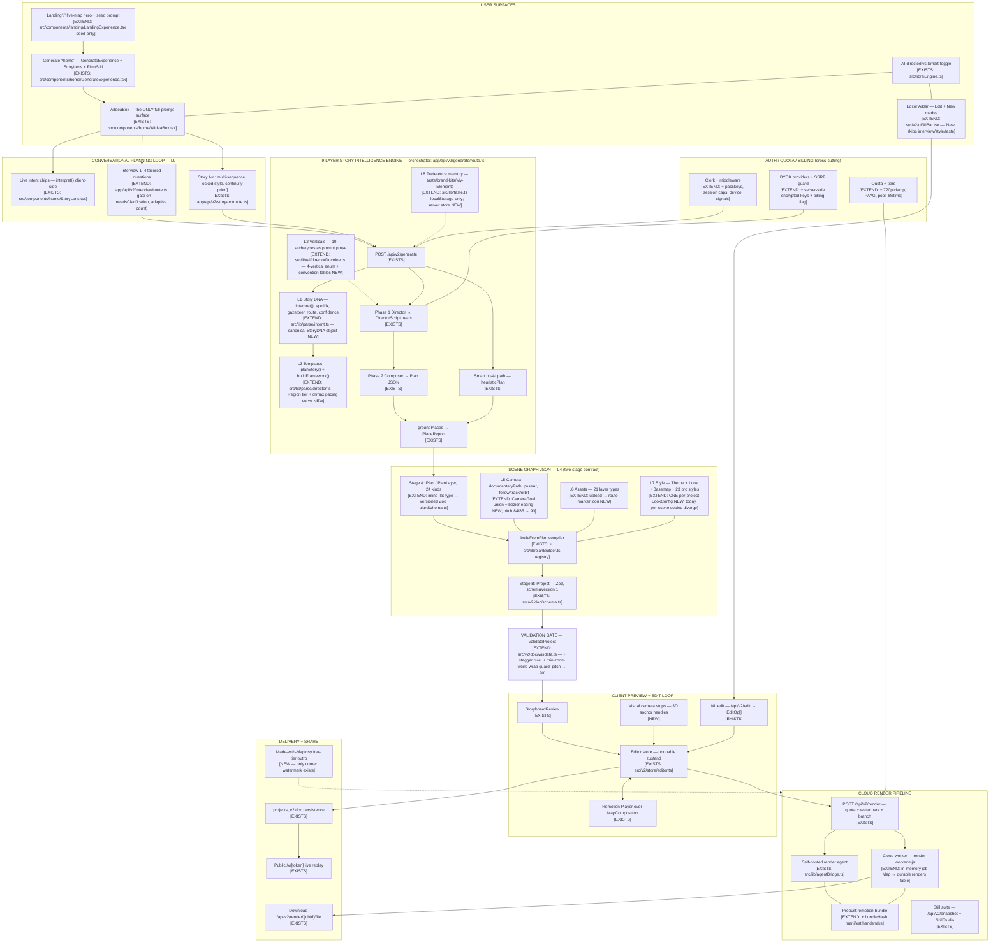

# 🌍 Mapinsy — Master Architecture Proposal

**The AI Map Story Builder: system diagram, data contracts, and operational architecture orchestrating the AI Story Agent ⇄ Scene Graph JSON Parser ⇄ Client-Side Rendering Context.**

This is the synthesis of a four-part, codebase-verified architecture study. Every `[EXISTS]`/`[EXTEND]` claim below was checked against the repository (branch `security-hardening`); nothing proposes replacing a working subsystem where extending it suffices.

| Document | Contents |
|---|---|
| **this file** | Master diagram, 9-layer status, reconciliation decisions, canonical reconciled tables, guardrail/showcase/fix coverage, unified rollout |
| [docs/architecture/SYSTEM-DIAGRAM.md](docs/architecture/SYSTEM-DIAGRAM.md) | Full diagram set: flowchart, happy-path sequence, ASCII fallback, component responsibility table |
| [docs/architecture/DB-SCHEMA.md](docs/architecture/DB-SCHEMA.md) | Complete Drizzle schema (21 tables), JSONB-vs-normalized decision, data-contract ↔ storage matrix |
| [docs/architecture/ORCHESTRATION.md](docs/architecture/ORCHESTRATION.md) | Pipeline stage contracts, Camera Goal Compiler, hard clamps, asset injection, validation gate, strict-AI policy, bundle-parity, micro-loader events |
| [docs/architecture/COMMERCIAL-SECURITY.md](docs/architecture/COMMERCIAL-SECURITY.md) | Tier enforcement matrix, complexity pricing, BYOK economics, anti-sharing, key security, watermark/outro enforcement, brief-vs-code conflict register |

> ⚠ **Naming**: the brief says **Mapinsy**; the codebase renders **Mapanisy** everywhere (localStorage keys `mapanisy-*`, watermark pill, viewer footer). Decide the canonical name **before** shipping the outro clip and showcase gallery — the brand gets baked into rendered MP4s.

---

## 1. Identity & the three planes

Mapinsy is an **AI Map Story Builder**, not an animation generator. The system is three planes joined by two contracts:

```
  AI STORY AGENT                SCENE GRAPH JSON              CLIENT RENDERING CONTEXT
  (server, per-request)         (the decoupling contract)     (one visual truth)
┌───────────────────────┐     ┌───────────────────────┐     ┌───────────────────────────┐
│ interpret() Story DNA │     │ Stage A: Plan          │     │ Remotion Player preview   │
│ interview 1–4 Qs (L9) │ ──▶ │  (AI-friendly, places, │ ──▶ │ Cloud worker render       │
│ Director → beats      │     │   camera GOALS)        │     │ Self-hosted agent render  │
│ Composer → Plan       │     │ Stage B: Project       │     │ Still snapshot            │
│ groundPlaces verify   │     │  (Zod, coordinates,    │     │  — ALL execute            │
│ buildFromPlan compile │     │   keyframes, themes)   │     │  MapComposition.tsx       │
└───────────────────────┘     └───────────────────────┘     └───────────────────────────┘
```

The **two-stage Scene Graph is intentional**: `Plan` (emitted by AI, references place *names* and high-level *camera goals*) compiles server-side via `buildFromPlan` into `Project` (`src/v2/doc/schema.ts`, Zod, `schemaVersion 1`, exact coordinates/keyframes — THE renderer contract). Keep both stages; the fix is to **version and Zod-validate the Plan stage** (`src/v2/doc/planSchema.ts` — today it is an inline TS type and malformed AI JSON is swallowed by per-layer try/catch).

**One visual truth:** preview, quick export, agent render, cloud render, and snapshot all execute `src/v2/render/MapComposition.tsx`. Corollary: any render-path change requires `npm run build:agent-bundle`, which §6 of ORCHESTRATION.md makes mechanically unskippable (bundle-hash handshake, 409 on mismatch).

---

## 2. Master system flowchart



Full sequence diagram, ASCII fallback, and the per-component responsibility table: [SYSTEM-DIAGRAM.md](docs/architecture/SYSTEM-DIAGRAM.md).

### Non-obvious truths the diagram encodes (verified in code)

1. **The Story Framework only constrains the Composer when no Director script exists** (arc/no-AI paths); on the normal AI path the deterministic storyboard is display-only. The orchestrator must not assume it is enforced.
2. **Strict "AI never falls back" is inconsistent today**: generate 502s on model failure but silently degrades to heuristic when *no key resolves*; edit hard-fails correctly; interview/storyarc degrade silently; `/api/v2/sequence` ignores `useAI` and has no auth/rate-limit. ORCHESTRATION.md §5 unifies this behind `requireAI()` (loud `428 no_ai_key`, never silent heuristic).
3. **`narrationLines` is a live L4 defect**: written as `(composition as any).narrationLines` in the generate route and stripped by every Zod parse (`src/v2/doc/schema.ts` has no such field). Multi-beat captions are silently destroyed on save. Fix before the DB becomes source of truth.

---

## 3. The 9 layers — implementation status

| Layer | Status | Where / what's missing |
|---|---|---|
| **L1** Intent / Story DNA | EXTEND | `interpret()` covers places/route/style/confidence; canonical `StoryDNA` object (`src/lib/parse/storyDna.ts`) is NEW — `emotion` + `target_audience` extracted nowhere; 3 unreconciled story-type taxonomies (Storyboard.pattern / DirectorScript.arc / Archetype.name) get one canonical `story_type` |
| **L2** Vertical classification | EXTEND | 10 archetypes exist as prompt prose in `directorDoctrine.ts`; the 4-vertical enum + machine-readable convention tables (`src/lib/parse/verticals.ts`) are NEW |
| **L3** Narrative templates | EXTEND | `planStory()` has patterns + establish/hero validation; missing the Region tier (gazetteer has no region→continent map), climax-weighted pacing (today flat `per = clamp(2.5, 6, dur/n)`) |
| **L4** Scene Graph JSON | EXTEND | `Project` (Zod) is solid; Plan stage needs versioned Zod; `narrationLines` fix; migration ladder past `schemaVersion 1` |
| **L5** Camera Director | EXTEND | Full motion engine exists (`documentaryPath` zoom-bell, follow/track/orbit); NEW: typed `CameraGoal` union so AI emits *goals*, never numbers; bezier easing; 90° pitch |
| **L6** Asset planner | EXTEND | 21 layer types incl. atmosphere/terrain/glowing routes/stickers; NEW: user upload → route marker (v2 lost v1's `RouteSpec.icon.customUrl`) |
| **L7** Global style engine | EXTEND | Themes/Looks/23 pro styles exist but are stored **per-scene** and can diverge; NEW: one `projects_v2.look_config` per project, compiler re-stamps every scene |
| **L8** Preference memory | EXTEND | `taste.ts`/brand kits/My Elements are localStorage-only (per-device, wiped on clear); NEW: `user_preferences` + `taste_events` server tables, fold job with the same `exp(-ageDays/30)` decay |
| **L9** Proactive planning | EXTEND | `/api/v2/interview` exists but runs **unconditionally** with a fixed 4-menu; NEW: `needsInterview()` gate on `Interpretation.confidence`/missing slots → adaptive 1–4 questions (rule in ORCHESTRATION.md §1) |

---

## 4. Cinematic guardrails → enforcement points

| Guardrail (brief §3) | Enforcement |
|---|---|
| Geography as active character | Director doctrine (`src/lib/ai/directorDoctrine.ts`) gains the principle: *terrain/rivers/ranges may only appear when they motivate the beat*; `VerticalConventions` carry per-vertical camera grammar so the Director's zoom/pitch choices are geography-motivated, not decorative |
| Preventing cognitive overload | **V-OVERLOAD** rule in `src/v2/doc/validate.ts`: max 2 thematic layers visible simultaneously; bordered-highlight + data-layer + arrow-layer may never overlap — auto-restagger (+0.35 s) or warn when AI-authored timing |
| Macro-to-micro accordion | Camera Goal sequences compile to `CameraLayer.waypoints[]` fed to `documentaryPath()` — continuous pulls by construction; hard cuts only via explicit scene transitions |
| Mapping the invisible | Already-shipped layer kinds carry it: `connections` (neon lattice), `spotlight`, `conflict`, `choropleth` (color bleeds), `radius` (blockade rings); the L2 convention tables tell the Director *when* to reach for them |
| Camera wrapping & zoom bounds | `minZoom(canvasWidth, tileSize=512) = log2(canvasWidth/512) + 0.05` — 16:9 ⇒ ~2.96, 9:16/1:1 ⇒ ~2.13; enforced at 4 layers: compiler, validation gate, per-frame `sanitizePose` + `renderWorldCopies={false}` + `minZoom` on the v2 `<Map>` (today only legacy paths set it), and editor slider floors |

---

## 5. Mandated fixes — concrete and verified

**90° camera pitch** — every clamp site, one coordinated commit, then `npm run build:agent-bundle`:

| File | Today (verified) | Change |
|---|---|---|
| `src/v2/doc/schema.ts:30` (`CameraPose.pitch`) | `max(85)` | `max(90)` |
| `src/v2/doc/schema.ts:709` (`TrackLayer.pitch`) | `max(84)` | `max(90)` |
| `src/v2/render/layers/renderHelpers.ts:71` (`sanitizePose`) | clamp 0–84 | 0–90 |
| `src/v2/doc/validate.ts:27` (`fixPose`) | clamp 0–84 | 0–90 |
| `src/v2/ui/applyEdits.ts:124-125` | clamp 0–85 | 0–90 |
| `src/v2/ui/Inspector.tsx` PoseEditor Tilt / quick Tilt | max 85 / 80 | 90 |
| `src/v2/render/MapComposition.tsx` `<Map>` | **no `maxPitch` prop** — MapLibre default clips regardless | add `maxPitch={90}` |
| `src/components/landing/FlyThroughMap.tsx:762` | `maxPitch={85}` | 90 |
| generate route beat contract + `Math.min(84, plan.cameraPitch)` | 75/84 | 90 |

**Other feature-spec rows:**

- **Aesthetic pruning**: Inspector "Look & grade" flips default-open → closed and gates behind the existing `proMode` flag — UI-gating only, no schema removal (pro map styles depend on `Look`). No LUTs, letterboxing, or video tracking anywhere in this architecture.
- **Visual camera stops** `[NEW]`: draggable 3D anchor handles in the preview, building on the shipped in-preview click-select/drag/scale/rotate machinery in `src/v2/ui/Canvas.tsx`; each handle is one `CameraLayer` waypoint; the form-based PoseEditor stays as the precise fallback.
- **Visual presets** (watercolor / ink-splatter / anime vector): three new entries in the signature/pro style registries (`src/lib/presets/`), expressed as `LookConfig` presets + basemap styles so they obey the one-look-per-project rule.
- **Media & asset injection**: full pipeline in ORCHESTRATION.md §3 — drop/URL → `POST /api/v2/assets` (moderation, resize to `full` + 256px `marker` variants) → `user_assets` table → `## USER ASSETS` block in the Composer prompt → `Plan` kind `"asset"` with `role: "route-icon" | "pin-photo" | "logo"` → `RouteLayer.iconUrl` (restores v1's `customUrl`) / `ImageLayer`.
- **Render stability**: the per-frame `delayRender` tile-settle gate + `preserveDrawingBuffer` fix is shipped; the remaining stability work is the **bundle-hash handshake** (ORCHESTRATION.md §6): `build-bundle.mjs` writes `manifest.json { bundleHash }`, render + snapshot routes 409 on mismatch — a stale `public/remotion-bundle/` becomes unshippable.
- **Workspace consistency**: one `PromptDraft` contract via new `src/lib/promptSession.ts` shared by landing, `/home` AiIdeaBox, and editor AiBar "New" (today AiBar posts only `{ idea, ai, useAI }`, skipping interview/style/taste).
- **Loading systems**: typed `PipelineEvent` vocabulary (`src/lib/progressEvents.ts`) + one fact source (`funFacts.ts` absorbs GeneratingOverlay's private list) + one `<MicroLoader>` used by generation overlay and both render queues.
- **3D data integration**: photoreal 3D tiles stay **BYOK-only** (the `google-3dtiles` key slot already exists in SettingsModal) so tile costs and Google ToS compliance sit with the key owner; the headless `photorealExportFallback` divergence is surfaced as a validation-gate warning instead of silently rendering differently.

---

## 6. Showcase validation suite → capability mapping

| # | Showcase story | Carried by (all existing unless noted) |
|---|---|---|
| 1 | Tour de Mont Blanc GPS flythrough | `track` layer + GPX adapter + 4 camera variants (`TrackVariant`); goal `route-follow` |
| 2 | USA cities > 5M bubbles | `bubbles` layer + `entities[]` beat data; vertical `data-comparison` |
| 3 | Largest national parks | `highlight` polygon shading + `spotlight`; goal `reveal` |
| 4 | Barcelona Cathedral 360° | goal `orbit` (`degrees: 360`) + `buildings3d`/photoreal basemap; needs the 90° pitch fix for the low sweep |
| 5 | NYC → Cook Islands arc | `route` layer arc mode + goal `fly-to` (`arc: "parabolic"`); needs the min-zoom clamp (Pacific-wide framing is exactly where world-wrap bites today) |
| 6 | Viking migrations | `flows` weighted vectors + `mapYear` historical basemap + vertical `history-military` |

Each becomes a seeded example on the landing page and a **regression fixture**: six stored prompts whose generated `Project` documents are snapshot-tested against the validation gate.

---

## 7. Reconciliation decisions (where the four deliverables differed)

The deliverables were designed in parallel; four collisions, resolved here — **these definitions are canonical**:

**R1 — One durable render table: `renders`** (DB-SCHEMA.md §2 shape) extended with three billing columns from the commercial design: `tierAtRender text notNull`, `priceCredits integer notNull default 0`, `ledgerEntryId uuid` (the debit row, refunded on failure). The commercial doc's thinner `render_jobs` sketch is dropped. `costTokens` is dropped in favor of `priceCredits`.

**R2 — One ledger: `credit_ledger`** (merging DB's `token_ledger` discipline with the commercial line-item vocabulary). Unit: credits, 1 credit = €0.01. Append-only, signed `delta`, denormalized `balanceAfter`, debits as a single guarded `INSERT … SELECT balanceAfter >= 0` (atomic across serverless instances):

```ts
export const creditLedger = pgTable("credit_ledger", {
  id:           uuid("id").primaryKey().defaultRandom(),
  userId:       uuid("user_id").notNull().references(() => users.id, { onDelete: "cascade" }),
  /** Signed credits: + grant/topup/refund, − debit/expiry. */
  delta:        integer("delta").notNull(),
  balanceAfter: integer("balance_after").notNull(),
  /** 'grant.pool' | 'grant.signup' | 'grant.promo' | 'topup' | 'render_debit'
   *  | 'render_refund' | 'ai_tokens' | 'fee_camera_script' | 'fee_style_layers'
   *  | 'expire.pool' | 'adjust' */
  kind:         text("kind").notNull(),
  jobId:        text("job_id"),          // renders.id
  projectId:    text("project_id"),
  route:        text("route"),           // '/api/v2/generate' …
  provider:     text("provider"),
  model:        text("model"),
  /** BYOK: ai_tokens rows are written with delta 0 (informational usage). */
  byok:         boolean("byok").notNull().default(false),
  aiTokensIn:   integer("ai_tokens_in"),
  aiTokensOut:  integer("ai_tokens_out"),
  complexityScore: decimal("complexity_score", { precision: 8, scale: 3 }),
  renderSeconds:   decimal("render_seconds", { precision: 10, scale: 2 }),
  stripeRef:    text("stripe_ref"),
  expiresAt:    timestamp("expires_at"), // pool grants only
  createdAt:    timestamp("created_at").defaultNow().notNull(),
}, (t) => [index("credit_ledger_user_idx").on(t.userId, t.createdAt)]);
```

**R3 — BYOK vault: `user_ai_keys` with envelope encryption** (COMMERCIAL-SECURITY.md §5.1 is canonical; DB's simpler `byok_keys` is dropped). Per-key random DEK (AES-256-GCM) wrapped by a `kekId`-versioned KEK from Docker secret / Vercel sensitive env — rotation re-wraps DEKs only. Plus the verification rule that makes billing unspoofable: **only a server-stored key that passed `/api/ai/test` (sets `verifiedAt`) earns the BYOK billing split**; the per-request `body.ai` path keeps working but never discounts.

**R4 — Anti-sharing is Clerk-native, not a parallel auth stack.** The DB doc's `webauthn_credentials` + `active_sessions` tables are dropped: Clerk ships first-party passkeys (enroll via `user.createPasskey()`), and session concurrency reads Clerk's `sessions.getSessionList()` — checked at the three expensive choke points (generate / render / snapshot), cached 5 min, oldest-session eviction with a visible device list in the dashboard. One local table remains:

```ts
export const userDevices = pgTable("user_devices", {
  id:         uuid("id").primaryKey().defaultRandom(),
  userId:     uuid("user_id").notNull().references(() => users.id, { onDelete: "cascade" }),
  /** SHA-256(per-user salt ‖ coarse signals), 16 hex — NOT comparable across users.
   *  Signals: UA family, platform, timezone, language, screen bucket, DPR bucket.
   *  Excluded by design: canvas/WebGL/audio prints, fonts, raw IP, precise geo. */
  deviceHash: text("device_hash").notNull(),
  label:      text("label"),
  geoCity:    text("geo_city"),
  geoCountry: text("geo_country"),
  trusted:    boolean("trusted").notNull().default(false), // passed a passkey step-up
  seenCount:  integer("seen_count").notNull().default(1),
  firstSeen:  timestamp("first_seen").defaultNow().notNull(),
  lastSeen:   timestamp("last_seen").defaultNow().notNull(),
}, (t) => [
  uniqueIndex("user_devices_user_hash_idx").on(t.userId, t.deviceHash),
  index("user_devices_user_idx").on(t.userId, t.lastSeen),
]);
// users: + deviceSalt text, + showcaseOptOut boolean default false
```

90-day retention cron; abuse ladder (concurrent-geo, device velocity) responds with notify → passkey step-up → manual review, never auto-ban.

Everything else in the four documents is non-conflicting and stands as written.

---

## 8. Commercial spine (summary — full detail in COMMERCIAL-SECURITY.md)

| Tier | Renders | Resolution | Branding | Agent path | Billing |
|---|---|---|---|---|---|
| `free` | 3/mo (shipped) | **720p** (`maxScale 0.34`, server-clamped) | watermark pill + **outro clip** (new tail `<Sequence>`, server-decided, cloud-forced) | ✗ | none |
| `payg` | per render | full | none | ✗ (cloud is the product) | prepaid credits, `priceCredits = clamp(49, 1999, round(49 × complexity))` |
| `pool` | until pool empty | full | none | ✓ | $11.99 mo/yr → monthly credit grant, expires at period end |
| `lifetime` | unlimited | full | none | ✓ | €60 one-time (`mode: "payment"` — new Stripe branch; `subscription.deleted` must never downgrade it) |

**Complexity scorer** is a new server-side function over the v2 `Composition` (frames × resolution-ratio × layer-count × terrain/buildings/satellite/photoreal multipliers) — the existing `complexityOf()` reads v1 fields that don't exist on v2 docs and must never feed billing. Debit at enqueue, refund on failure, preflight `/api/v2/render/quote` for honest price display.

**BYOK economics**: with a verified key, `ai_tokens` line items drop to 0 (logged for the usage dashboard); what remains billable is workflow value — `fee_camera_script` (Director ran), `fee_style_layers` (style lock/grounding), and cloud render minutes (never discounted; the GPU is ours).

**Shipped leaks to fix under this heading** (verified): `GET /api/v2/restyle?apiKey=…` puts the user's key in the URL (→ POST body/header); `users.agent_key` is plaintext and authenticated via `?key=` query (→ store `sha256`, move to `Authorization: Bearer`); `BYPASS_QUOTA` and the `!!db` watermark escape must refuse/invert in production.

---

## 9. Unified rollout order (dependency-safe, merged across all four docs)

1. **Migrations bootstrap** — first committed drizzle migrations (`0000_baseline` + `0001`): all new tables (§7 canonical set + DB-SCHEMA.md), `projects_v2.doc` text→jsonb, `look_config`, subscriptions columns. Bundled code fixes: `narrationLines` into `Composition`, `/api/v2/projects` stops stringifying.
2. **Hard clamps + Plan schema** — `planSchema.ts`, `cameraGoals.ts`, the 90° pitch table (§5), min-zoom formula, `renderWorldCopies={false}` — one commit + `npm run build:agent-bundle`.
3. **Server commercial clamps** — free 720p `maxScale`, agent-path denial for branded tiers, production hardening of `BYPASS_QUOTA`/`!!db`.
4. **Validation gate extensions** — V-OVERLOAD, V-STAGGER, aspect-aware zoom floor. Additive, immediately protective.
5. **Outro** — `src/v2/render/Outro.tsx`, both compositions, `calculateMetadata` + `OUTRO_FRAMES`, SharedViewer branding, rebuild bundle.
6. **Bundle stamp** — manifest hash + 409 gate + agent echo. Independent; ships any time.
7. **Strict-AI unification + BYOK vault** — `requireAI()` 428 policy, `resolveAIForUser()` precedence, envelope crypto, key CRUD + `/api/ai/test` verification, leak fixes.
8. **Complexity + ledger + Stripe extension** — scorer, quote endpoint, debit/settle, credit packs + pool prices + lifetime SKU, unify the three hardcoded pricing surfaces from `TIERS`.
9. **Story DNA + verticals + interview gate** — `storyDna.ts`, `verticals.ts`, `needsInterview()`, 5-tier `planStory` — behavior-visible, behind the engine toggle for A/B.
10. **Asset pipeline** — `/api/v2/assets`, moderation, `RouteLayer.iconUrl`, Composer `## USER ASSETS` (needs the DB).
11. **Anti-sharing + showcase** — Clerk passkeys + session caps + device beacon; consent flag + `showcase_entries` over the existing share-token viewer.
12. **Prompt-surface unification + micro-loader + visual camera stops** — `promptSession.ts`, `progressEvents.ts` + `<MicroLoader>`, Canvas anchor handles.

---

*Method note: produced by a 16-agent workflow — 7 subsystem mappers extracting exact contracts from the codebase, 4 parallel architects, followed by inline verification of every load-bearing file/line/constant claim against the repository. All cited paths and line numbers were confirmed on branch `security-hardening` (2026-07-07).*
