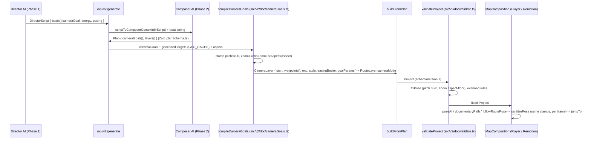
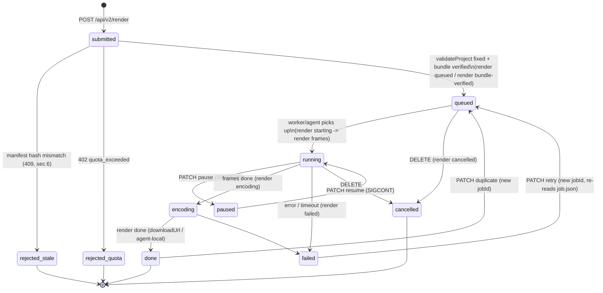

> **Part of the Mapinsy master architecture proposal.** Read [ARCHITECTURE.md](../../ARCHITECTURE.md) first — it holds the reconciliation decisions where the four deliverables differ, and its canonical choices supersede this document.
> Naming note: the `user_ai_keys` sketch in §5.2 is finalized in COMMERCIAL-SECURITY.md §5.1 (envelope encryption with wrapped DEKs), which is canonical.

# Mapinsy — Operational Orchestration Architecture
## AI Story Agent ⇄ Scene Graph JSON Parser ⇄ Client-Side Rendering Context

**Design stance:** every stage below *extends* the shipped two-phase Director/Composer pipeline (`app/api/v2/generate/route.ts`), the Story Framework (`src/lib/parse/framework.ts`), and the v2 scene graph (`src/v2/doc/schema.ts`). Nothing working is replaced. New code lands in small, named modules that the existing routes import.

---

## 1. Pipeline stages and contracts

The orchestrated pipeline is the existing runtime flow of `app/api/v2/generate/route.ts` with four inserted stages (DNA, vertical, camera-goal emission, extended validation) and one repaired gate (proactive planning). Contract for each stage:

| # | Stage | Module (existing → extension) | Input contract | Output contract |
|---|-------|------------------------------|----------------|-----------------|
| 0 | **Prompt intake** | Unify the three prompt surfaces (`src/components/landing/LandingExperience.tsx`, `src/components/home/AiIdeaBox.tsx`, `src/v2/ui/AiBar.tsx` "New" mode) behind a new shared hook `src/lib/promptSession.ts` | free text + `useAiEngine()` toggle (`src/lib/aiEngine.ts`) + style + `AssetRef[]` (§3) + `tasteSummary()` (`src/lib/taste.ts`) | `PromptDraft = { idea, styleId, useAI, ai (BYOK), assets, mode, taste }` — same body for all three surfaces; fixes the current asymmetry where AiBar posts only `{ idea, ai, useAI }` |
| 1 | **Deterministic interpretation** | `interpret()` in `src/lib/parse/intent.ts` (unchanged) | `PromptDraft.idea` | `Interpretation { corrected, action, locations, route, style, durationSec, confidence, needsClarification, preview }` |
| 2 | **Proactive planning gate** | `needsInterview()` — new function in `src/lib/parse/intent.ts`, consumed by `AiIdeaBox.startInterview` and `/api/v2/interview` | `Interpretation` (+ prior interview state) | `{ ask: boolean; slots: DnaSlot[]; count: 1–4 }` — rule defined below |
| 3 | **Story DNA** | new `src/lib/parse/storyDNA.ts`, called inside `buildFramework()` (`src/lib/parse/framework.ts`) | `Interpretation` + interview answers + `matchArchetype()` (`src/lib/ai/directorDoctrine.ts`) | `StoryDNA { storyType, vertical, emotion, pace, focus, cameraFeel, targetAudience, confidence, source }` |
| 4 | **Vertical classification** | new `src/lib/parse/verticals.ts` | `StoryDNA` + `Interpretation` | `StoryVertical ("travel"\|"history"\|"logistics"\|"data")` + `VerticalConventions` (machine-readable editing conventions: pacing curve, layer budget, camera grammar, label density, default pro style from `src/lib/presets/proMapStyles.ts`) |
| 5 | **Narrative template selection** | `planStory()` in `src/lib/parse/director.ts`, extended to an explicit 5-tier `World → Continent → Region → Progression → Climax` template; add region→continent data to `src/lib/parse/gazetteer.ts` (today `continentOf()` covers only countries + ~55 cities, so region-led prompts lose the context beat); replace the flat `per = clamp(2.5, 6, dur/scenes)` with the vertical's climax-weighted pacing curve | `Interpretation` + `StoryDNA` + `VerticalConventions` | `Storyboard { pattern, scenes: StoryScene[], totalSec, notes }` (existing type, tier tagged on each scene) |
| 6 | **Director script (Phase 1)** | `directorCall()` in `app/api/v2/generate/route.ts` — `directorInput` already pre-injects "## ENGINE PRE-ANALYSIS"; add serialized `StoryDNA` + `VerticalConventions` blocks | idea + framework pre-analysis + interview + taste + DNA | `DirectorScript { thesis, arc, beats: DirectorBeat[] }` — `DirectorBeat` gains `cameraGoal: CameraGoal` (§2) and **drops the requirement to emit numeric `zoom/pitch/bearing`** (numbers become optional overrides, honoring L5 "never frame-by-frame coordinates") |
| 7 | **Camera Goal emission** | Composer contract in `SYSTEM` prompt + `scriptToComposerContext()` | `DirectorScript.beats[].cameraGoal` | `Plan.cameraGoals: CameraGoal[]` (new Plan field alongside the legacy `cameraPoses`, which stays for back-compat) |
| 8 | **Scene graph compilation** | `buildFromPlan()` (`app/api/v2/generate/route.ts`, exposed via `src/lib/planBuilder.ts` registry) + new `compileCameraGoals()` in `src/v2/doc/cameraGoals.ts`; **extract `Plan` into a versioned Zod schema** `src/v2/doc/planSchema.ts` (today `Plan` is a TS type only — malformed AI JSON is swallowed by per-layer try/catch) | validated `Plan` + `PlaceReport` from `groundPlaces()` | `Project` (Zod, `schemaVersion 1`, `src/v2/doc/schema.ts`) — the Scene Graph JSON contract; `Project` gains an optional `story: { dna, dirScriptDigest, verification }` block so DNA survives persistence (today it lives only in the HTTP response) |
| 9 | **Validation gate** | `validateProject()` / `validateComposition()` in `src/v2/doc/validate.ts`, extended (§4) | `Project` | fixed `Project` + `ValidationIssue[]` (`level: "fixed"\|"warning"`) — runs in generate (post-build), `/api/v2/render` (already wired), and client pre-flight in `src/v2/ui/RenderButton.tsx` (same isomorphic module) |
| 10 | **Preview** | `useEditor.load()` (`src/v2/store/editor.ts`) → `@remotion/player` with `MapComposition` (`src/v2/render/MapComposition.tsx`) | `Project` | live canvas; identical component tree to headless render (§6) |

### The proactive-planning rule (when to ask 1–4 questions)

Today `AiIdeaBox.tsx` (~line 193) interviews **unconditionally** (`if (filled.length === 1 && useAI && !iv)`), wasting the vagueness signal that `interpret()` already computes. Replace with:

```ts
// src/lib/parse/intent.ts
export type DnaSlot = "focus" | "tone" | "energy" | "length";
export function needsInterview(it: Interpretation, iv?: Record<string,string>) {
  const missing: DnaSlot[] = [];
  if (it.locations.length === 0 && !it.route) missing.push("focus");
  if (!it.style)                              missing.push("tone");   // emotion proxy
  if (it.action === "unknown")                missing.push("energy");
  if (!/\b(\d+\s*(s|sec|seconds?)|short|long|quick)\b/i.test(it.raw)) missing.push("length");
  const unanswered = missing.filter(s => !iv?.[s]);
  // RULE:
  //  confidence >= 0.75 AND <=1 slot missing  -> proceed, no questions (defaults)
  //  0.55 <= confidence < 0.75                -> ask ONLY the unanswered slots (1..4)
  //  confidence < 0.55 (= it.needsClarification, the existing threshold)
  //                                           -> always ask, "focus" question mandatory
  if (it.confidence >= 0.75 && unanswered.length <= 1) return { ask: false, slots: [], count: 0 };
  const slots = it.needsClarification && !unanswered.includes("focus")
    ? (["focus", ...unanswered] as DnaSlot[]) : unanswered;
  return { ask: slots.length > 0, slots: slots.slice(0, 4), count: Math.min(4, Math.max(1, slots.length)) };
}
```

`/api/v2/interview` (`app/api/v2/interview/route.ts`) accepts the `slots` list in the body and prunes `heuristicQuestions()`/the AI `sanitize()` output to exactly those ids — questions become adaptive 1–4, not a fixed 4-menu. Because `heuristicQuestions()` is key-free, the gate also runs in Smart (no-AI) mode, and the arc path (`/api/v2/storyarc`) runs it once on the combined ideas asking only global slots (tone/length).

---

## 2. Camera Goal Compiler

### 2.1 The goal vocabulary (typed, in the Scene Graph contract)

New module `src/v2/doc/cameraGoals.ts` (Zod, exported through `src/v2/doc/schema.ts`):

```ts
export const CameraGoalType = z.enum(["orbit", "pan", "reveal", "fly-to", "route-follow"]);

export const CameraGoal = z.discriminatedUnion("type", [
  z.object({ type: z.literal("orbit"),        target: PlaceRef, degrees: z.number().min(20).max(360).default(75),
             pitch: z.number().min(0).max(90).default(55), zoom: z.number().optional() }),
  z.object({ type: z.literal("pan"),          from: PlaceRef, bearing: z.number().default(90),
             spanFactor: z.number().min(0.2).max(1.5).default(0.7) }),
  z.object({ type: z.literal("reveal"),       target: PlaceRef, pullBack: z.number().min(1).max(6).default(3) }),
  z.object({ type: z.literal("fly-to"),       target: PlaceRef, arc: z.enum(["parabolic","direct"]).default("parabolic"),
             settleSec: z.number().min(0).max(2).default(0.4) }),
  z.object({ type: z.literal("route-follow"), routeLayerId: z.string().optional(),
             mode: z.enum(["follow","frame","chase","orbit"]).default("follow") }),
]);
```

This unifies the three uncoordinated contracts that exist today: `CameraLayer.style` (`schema.ts:114` — fly-in/zoom-out/orbit/push-in/pan/hold), `RouteLayer.cameraMode` (`schema.ts:214`), and `TrackVariant` (`schema.ts:659`). None are removed — the compiler targets them.

### 2.2 Compilation onto the existing pose/keyframe system

`compileCameraGoals(goals, ctx)` produces exactly what the renderer already consumes, so **`MapComposition.tsx` needs no new motion engine**:

- `fly-to` → `CameraLayer.style = "fly-in"`, target pose as `end` (parabolic arc comes free from the existing quadratic-Bézier zoom bell in `legPose`, `src/v2/render/layers/renderHelpers.ts:118-134`).
- `reveal` → `style = "zoom-out"` with `start = target` and `end` pulled back by `pullBack` zoom levels.
- `orbit` → `style = "orbit"`; the hardcoded sweep `bearing = s.bearing + p*75` (`renderHelpers.ts:190`) is parameterised: `poseAt` reads `degrees` from a new optional `CameraLayer.goalParams` field instead of the literal 75. Same for pan's `span * 0.7` (`renderHelpers.ts:193` — becomes `spanFactor`) and `DWELL_WEIGHT = 0.55` (`renderHelpers.ts:137`).
- `route-follow` → sets `RouteLayer.cameraMode` + `framesCamera = true`; `followRoutePose` (`renderHelpers.ts:322-345`) is unchanged.
- A **sequence** of goals compiles to `CameraLayer.waypoints[]` fed to `documentaryPath()` (`renderHelpers.ts:139-167`) — the existing dwell + zoom-bell scheduler, which already receives LINEAR progress from `MapComposition.tsx:116-121`.

**Bezier easing:** the schema's `Easing` enum ships `"spring"` unimplemented (silent fallback at `MapComposition.tsx:114`). Add `cubicBezier(x1,y1,x2,y2)` to `easings` in `src/lib/interp.ts:45-52`, add `"bezier"` to the `Easing` enum plus optional `CameraLayer.easingBezier: [n,n,n,n]`, and implement `"spring"` as the preset `cubicBezier(0.34, 1.3, 0.64, 1)`. Per-goal defaults live in the compiler (fly-to: `cinematic` 5th-order smoothstep already in interp.ts; orbit: `linear`).

Legacy `Plan.cameraPoses` still works: `buildFromPlan` keeps its ≤8-pose path; when both are present, `cameraGoals` wins.

### 2.3 The HARD CLAMP layer

**Pitch to full 90°** (mandated). Every clamp site changes in one coordinated commit, then `npm run build:agent-bundle`:

| File | Today | Change |
|------|-------|--------|
| `src/v2/doc/schema.ts:30` (`CameraPose.pitch`) | `max(85)` | `max(90)` |
| `src/v2/doc/schema.ts:709` (`TrackLayer.pitch`) | `max(84)` | `max(90)` |
| `src/v2/render/layers/renderHelpers.ts:71` (`sanitizePose`) | clamp 0–84 | clamp 0–90 |
| `src/v2/doc/validate.ts:27` (`fixPose`) | clamp 0–84 | clamp 0–90 |
| `src/v2/ui/applyEdits.ts:124-125` | clamp 0–85 | clamp 0–90 |
| `src/v2/ui/Inspector.tsx:209` (PoseEditor Tilt) / `:556` (quick Tilt) | max 85 / 80 | max 90 |
| `src/v2/ui/Map3DStyleModal.tsx:207` | max 84 | max 90 |
| `app/api/v2/generate/route.ts` `map3dCustom.pitch` (~:191), beat contract (~:492 "0–75"), `Math.min(84, plan.cameraPitch)` (~:1286) | 84/75 | 90 |
| `src/v2/render/MapComposition.tsx:576-609` | **no `maxPitch` prop** — MapLibre's library default clips regardless of schema | add `maxPitch={90}` on the `<Map>` |
| `src/components/landing/FlyThroughMap.tsx:762` | `maxPitch={85}` | 90 |

**World-wrap minimum zoom.** One world copy must always fill the frame. In MapLibre the projected world is `tileSize · 2^zoom` px wide, so:

```
minZoom(canvasWidth, tileSize = 512) = log2(canvasWidth / tileSize) + ε   (ε = 0.05 safety)
```

With `dimsFor(aspect)` (`src/v2/doc/schema.ts:942`): 16:9 → `log2(3840/512) ≈ 2.91 → 2.96`; 9:16 and 1:1 → `log2(2160/512) ≈ 2.08 → 2.13`. Export `minZoomForAspect(aspect)` from `src/v2/doc/cameraGoals.ts`.

The clamp runs at **four layers** (defense in depth):

1. **Compiler** — `compileCameraGoals()` clamps every emitted pose zoom to `minZoomForAspect(ctx.aspect)`.
2. **Validation gate** — `fixPose` in `src/v2/doc/validate.ts:26` (today floors at 0.5) becomes aspect-aware: `validateComposition` passes `dimsFor(comp.aspect).width` down.
3. **Renderer, per frame** — `sanitizePose` (`renderHelpers.ts:70`, floor 0.5 today) receives the composition width from `MapComposition` (which knows it via `useVideoConfig()`); additionally set `renderWorldCopies={false}` and `minZoom={minZoomForAspect(aspect)}` on the v2 `<Map>` in `MapComposition.tsx:576-609` — today only the legacy paths do this (`src/remotion/MapScene.tsx:496`, `src/lib/codegen/mapScene.ts:348`).
4. **Editor input** — Inspector zoom sliders (`Inspector.tsx:207` min 1, `:548` min 1) use the dynamic floor; the generate SYSTEM prompt states the floor so the AI never proposes zoom < 3.

### 2.4 Camera-goal compilation path (sequence diagram)



---

## 3. Asset Injection pipeline

Goal: "user uploads photo → becomes route marker icon" (mandated). Extends the existing **My Elements** machinery (`src/lib/elements.ts`: `SavedElement { id, name, layerType, layer, createdAt }`, localStorage `"mapanisy-elements"`, cap 120) and the brand-logo path (`src/lib/brandKits.ts` `BrandKit.logo` → screen-anchored ImageLayer, applied at `Inspector.tsx:604-608`).

**Stages:**

1. **Intake** — the unified prompt workspace (`GenerateExperience`, which already accepts GPX/TCX/KML/GeoJSON page-wide drops) additionally accepts image drops/URLs. Upload → `POST /api/v2/assets` (new route; Clerk-gated + `rateLimit("assets", clerkId, 20/60s)` per the pattern in `src/lib/rateLimit.ts`).
2. **Moderation + resize** — server-side: MIME sniff (reject non-image/svg-sanitize), max 10 MB, optional one-shot AI vision moderation via `aiComplete` when a key resolves; transcode with sharp to two variants: `full` (≤1600px WebP) and `marker` (256px, center-cropped, rounded). SVG stickers pass through the same sanitizer used for the AI `"sticker"` plan kind (data-URL → ImageLayer path in `buildFromPlan`).
3. **Asset registry** — new drizzle table in `src/lib/db/schema.ts`: `assets { id text PK, userId uuid FK→users.id cascade, kind ("image"|"logo"|"svg"), name, url, markerUrl, width, height, createdAt }` (dev fallback: `.dev-data/assets`, mirroring `src/lib/devAgentStore.ts`). `SavedElement` gains an optional `assetId` so My Elements and Brand Kits reference registry rows instead of raw data-URLs; localStorage stays as the offline cache.
4. **AI asset planner** — the generate body gains `assets: AssetRef[] = { id, name, kind, w, h }`; `composerInput` appends a `## USER ASSETS` block. `Plan` (now `src/v2/doc/planSchema.ts`) gains a kind: `{ kind: "asset", assetId, role: "marker" | "route-icon" | "pin-photo" | "logo", place? } & Styled & Timed`. The Director may reference assets in beats ("the photo of the summit appears at the Mont Blanc arrival") — its doctrine (`src/lib/ai/directorDoctrine.ts`) gets one added principle: *use user assets where they carry narrative weight; never decorate*.
5. **Layer creation** in `buildFromPlan`:
   - `role: "pin-photo" | "marker"` → `ImageLayer` (`src/v2/doc/schema.ts`: `{ url, anchor, sizePx, rounded, caption, transform }`) at the geocoded `place`.
   - `role: "route-icon"` → restore the v1 capability lost in v2: add `iconUrl?: string` to `RouteLayer` (precedent: v1 `RouteSpec.icon.customUrl`, `src/lib/types.ts:166`); rendered at the route head instead of the `icon` enum glyph. Follow the full new-field wiring checklist in `src/v2/layers/registry.ts` (schema → factory → Inspector → MapComposition → generate/edit routes → `npm run build:agent-bundle`).
   - `role: "logo"` → screen-anchored ImageLayer named "Brand logo" (existing BrandKitPanel behavior).

Because assets are HTTPS URLs served from the app origin, they render identically in the Player, the agent bundle, and the cloud worker (same-origin discipline as the `/api/sat`//`api/dem` tile proxies in `src/lib/maplibre.ts`).

---

## 4. Validation gate (extended)

`validateComposition()` in `src/v2/doc/validate.ts` keeps its mutate-and-report contract (`ValidationIssue { level: "fixed"|"warning", layer?, message }`) and gains:

- **V-CLAMP** — the §2.3 clamps: `fixPose` pitch 0–90, zoom floored at `minZoomForAspect(comp.aspect)` (gate must now receive the aspect, which it has via `comp`).
- **V-OVERLOAD (cognitive load)** — sweep the timeline in 0.25 s steps; *thematic* layers = filled `highlight`, `choropleth`, `bubbles`, `flows`/`connections`, `heatmap`, `radius`. Rules: (a) **max 2 thematic layers visible simultaneously**; (b) the brief's hard veto — a bordered highlight + a data layer + an arrow/flow layer must **never** overlap: when detected, push the latest layer's `timing.inSec` to the earliest window end + 0.35 s (`level: "fixed"`), unless the layer carries AI-authored timing (`hasAiTiming` semantics from `buildFromPlan`) — then emit `level: "warning"` and let the human decide.
- **V-STAGGER (fade windows)** — consecutive thematic entrances must be ≥ 0.35 s apart (the same constant as `Timing.fadeInSec` default); auto-space (`fixed`). This codifies what `inAt()`/`staggerFor()` do heuristically at compile time so hand edits and AI-timed docs can't stack everything at once (today only the T1 two-titles rule exists).
- **V-T1** — unchanged.

**Where it runs:** (1) `POST /api/v2/render` before enqueue (already wired — the FIXED project renders); (2) end of `buildFromPlan` in generate, with `fixes/warnings` surfaced in the response `_meta` so `StoryboardReview` can show them; (3) client pre-flight in `RenderButton.tsx` before POST — the module is isomorphic, no new endpoint needed.

---

## 5. Strict AI-mode error propagation + BYOK key resolution

### 5.1 Uniform strictness policy

The "AI selected never falls back" rule is currently inconsistent (edit = 400 loud; generate silently degrades to heuristic when **no key resolves**, `route.ts:2221-2235`; sequence ignores `useAI` entirely; interview/storyarc fall back silently). Policy matrix, enforced by a shared helper `requireAI(body)` in `src/lib/ai/providers.ts`:

| Route | Class | Behavior when `useAI !== false` and no plan/no key |
|---|---|---|
| `/api/v2/generate` | plan-affecting, **strict** | key exists, model fails → **502** (already shipped). **Fix:** no key resolves → **428** `{ error: "AI-directed mode is on but no AI key is available", code: "no_ai_key", aiConfigured: false }` — never the silent `heuristicPlan` 200. Heuristic runs only when `useAI === false`. |
| `/api/v2/edit` | plan-affecting, strict | already correct (400, never falls back) — becomes 428 for consistency |
| `/api/v2/sequence` | plan-affecting, strict | add the missing `auth()` + `rateLimit` (it has neither today) and honor `useAI` with the same 428 |
| `/api/v2/interview`, `/api/v2/storyarc` | advisory | deterministic base allowed (`heuristicQuestions` / `buildArc`) but the response **must** carry `provider: "heuristic"` / `source: "logic"` (both already do) and the client must badge "Smart fallback" — degradation is visible, never silent |

Client contract: `promptSession.ts` maps `code: "no_ai_key"` to a single actionable UI ("Connect a key in Settings, or switch to Smart mode") on all three prompt surfaces.

### 5.2 BYOK key resolution order

New `resolveAIForUser(userId, requestAi)` replacing the inline `configFromUser(body.ai) ?? resolveAIConfig()` at its five call sites (generate :2140, edit :509, interview :108, storyarc :60, sequence :160):

1. **Request-scoped user key** — `configFromUser(body.ai)` (`src/lib/ai/providers.ts`), SSRF-guarded (`isSsrfSafeUrl`), sourced from localStorage `"mapanisy-ai"` (`src/v2/ui/SettingsModal.tsx`). Highest priority — unchanged.
2. **Stored encrypted key** — new table `user_ai_keys { userId FK cascade, provider, model, baseUrl, keyCiphertext, keyIv, keyTag, createdAt }` (`src/lib/db/schema.ts`), AES-256-GCM under an env master secret; SettingsModal gains "Save to my account"; plaintext never returned to the client, decrypted server-side per request. This closes the gap that BYOK is currently invisible to the server (blocking the brief's BYOK-shifts-billing model).
3. **Platform key** — `resolveAIConfig()` env chain (ANTHROPIC_API_KEY → GOOGLE_AI_KEY → AI_BASE_URL+key → OPENAI_API_KEY), unchanged.
4. **Nothing resolves** — loud **428** per §5.1. No tier ever silently substitutes heuristics.

Every AI response includes `_meta.keySource: "request" | "stored" | "platform"`; billing branches on it (`keySource !== "platform"` → skip token metering, meter workflow value instead) and `_meta.tokensUsed` — computed today but discarded — is persisted alongside `renderLogs`.

---

## 6. Preview/render parity — making a stale bundle unshippable

**Hazard:** agent, cloud worker, and snapshot all render from the prebuilt `public/remotion-bundle/` (`scripts/build-bundle.mjs`); any change under `src/v2/render/**` or `src/remotion/**` is invisible to headless renders until `npm run build:agent-bundle` (documented live incident — bundle stale since Jun 17). `/api/agent/bundle-url` only checks that `index.html` exists.

**Architecture — build step + version stamp, checked at render time:**

1. **Stamp at build.** `scripts/build-bundle.mjs` computes `bundleHash = sha256(content hashes of src/v2/render/**, src/remotion/**, src/v2/doc/**, src/lib/interp.ts, src/lib/maplibre.ts)` and writes `public/remotion-bundle/manifest.json { bundleHash, builtAt, gitSha, schemaVersion }`. `npm run build` already chains `build:agent-bundle`, so production is stamped automatically.
2. **Expected hash at serve time.** New `src/lib/bundleStamp.ts` exports `expectedBundleHash()` — in production, baked at `next build` (same chain, guaranteed equal); in dev, recomputed live from the same file set.
3. **Enforce at every render entry point:**
   - `POST /api/v2/render` and `POST /api/v2/snapshot`: compare manifest vs expected **before** enqueue/`renderStill`; mismatch → **409** `{ error: "stale_render_bundle", fix: "npm run build:agent-bundle", expected, found }`. The job never starts, so "renders ignore my fix" cannot recur.
   - `GET /api/agent/bundle-url`: response gains `bundleHash`; the agent (`packages/agent/agent.mjs`, served by `/api/agent/script`) echoes the hash it rendered with in `POST /api/agent/complete`; a mismatch fails the job with an explicit error instead of completing silently.
   - The hash is stamped into the `renderLogs` row for audit, and the share viewer/`_meta` can report which renderer build produced an artifact.
4. **Dev ergonomics:** a `predev` check warns when hashes diverge; the 409 is the hard backstop.

Parity is otherwise inherent: preview and render share `MapComposition` (single source of visual truth), the same clamps run per frame in both (`sanitizePose`), and the same-origin tile proxies keep tile inputs identical. The one disclosed divergence stays disclosed: `basemap.photoreal3d` headless fallback (`photorealExportFallback`, `MapComposition.tsx:184`) must be surfaced as a `warning` by the validation gate at render time.

---

## 7. Micro-loader status hook events

**Consolidation first:** `src/lib/funFacts.ts` (today: `RENDER_FUN_FACTS`, `nextFunFact()`, wired only into the legacy `RenderQueueWidget`) absorbs the 14-fact inline `FACTS` array from `src/components/home/GeneratingOverlay.tsx` → exports `EARTH_FACTS`, `RENDER_FUN_FACTS`, `nextFunFact(category?: "earth" | "render")`. One fact source, both loaders.

**Typed event vocabulary** — new `src/lib/progressEvents.ts`:

```ts
export type PipelineEvent =
  // generation (drives GeneratingOverlay phase pills; today Director->Composer pills exist — this formalizes them)
  | { e: "intake:interpreted";  confidence: number; locations: number }
  | { e: "interview:pending";   count: 1|2|3|4 }
  | { e: "dna:extracted";       vertical: StoryVertical; storyType: string }
  | { e: "director:start" } | { e: "director:beats"; beats: number }
  | { e: "compose:start" }  | { e: "compose:plan";  layers: number }
  | { e: "ground:places";       checked: number; corrected: number }
  | { e: "compile:scenegraph" }
  | { e: "validate:done";       fixed: number; warnings: number }
  | { e: "preview:ready" }
  // render job (server-emitted)
  | { e: "render:queued" }
  | { e: "render:bundle-verified"; bundleHash: string }        // §6 gate passed
  | { e: "render:starting" }
  | { e: "render:frames";       progress: number; fps?: number }
  | { e: "render:encoding" }
  | { e: "render:paused" } | { e: "render:resumed" }
  | { e: "render:done";         downloadUrl: string | null }
  | { e: "render:failed";       error: string }
  | { e: "render:cancelled" };
```

**Emission and consumption:**
- Server jobs: `src/lib/serverRender.ts` (stdout JSON-line progress) and `src/lib/agentBridge.ts` (`/api/agent/progress`) replace free-text `message` with `{ event: PipelineEvent, factSeed: number }`; `GET /api/v2/render` (already polled every 2 s by `src/v2/ui/RenderQueue.tsx`) forwards it per job. `factSeed` keeps the rotating fact deterministic across polls.
- Client: a shared `<MicroLoader events fact>` component replaces the bare `msg` box in `RenderButton.tsx` and is mounted in the v2 `RenderQueue.tsx` — closing the gap that fun facts currently reach only the legacy widget. `GeneratingOverlay` consumes the generation-phase events through the same component (generate remains one HTTP call; the client synthesizes `intake/interview/preview` events locally and reads `director/compose` phases from the existing overlay plumbing — an SSE upgrade of generate is a later, non-blocking option).

### Render job lifecycle (state diagram)



(States map 1:1 onto the existing `ServerJobStatus` "queued|running|done|failed|cancelled" + `paused` flag in `src/lib/serverRender.ts` and the agent statuses in `src/lib/agentBridge.ts`; `rejected_*` are pre-queue HTTP outcomes, `encoding` is a sub-phase of `running` surfaced only as an event.)

---

## Aesthetic pruning (honored)

No external video tracking, no LUT controls, no letterbox controls are added anywhere in this architecture. Existing `Look.letterbox` / 3-way grade fields stay in the schema (pro map styles depend on them) but the Inspector "Look & grade" advanced section flips its default from open (`Inspector.tsx:426`, `useState(true)`) to closed and gates behind the existing `proMode` flag in `src/v2/store/editor.ts` — UI gating only, no schema removal. The Camera Goal vocabulary deliberately excludes any tracking/match-move goal type.

## Rollout order (dependency-safe)

1. `src/v2/doc/planSchema.ts` (Plan Zod) + `cameraGoals.ts` + clamp changes (§2.3) + `build:agent-bundle` — one commit, since renderer and schema move together.
2. Validation gate extensions (§4) — pure additive, immediately protective.
3. Strict-mode unification + `resolveAIForUser` (§5) — server-only, client copy update.
4. Bundle stamp (§6) — independent, ships any time.
5. `needsInterview` gate + `storyDNA.ts` + `verticals.ts` + `planStory` 5-tier (§1) — behavior-visible, behind the existing engine toggle for A/B.
6. Asset pipeline (§3) — needs the DB table; last.