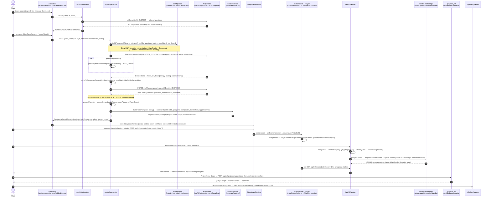

# Mapinsy — Master System Diagram Set

> Deliverable 1 of the master architecture proposal. Repo ground truth as of branch `security-hardening`.
> Naming note: the brief says **Mapinsy**; the codebase renders **Mapanisy** everywhere (localStorage keys `mapanisy-*`, watermark, viewer footer). One canonical name must be chosen before any new persistence/table naming below is implemented.

Tag legend: **[EXISTS: path]** — implemented today at that path. **[EXTEND: path]** — the module exists there but is missing part of the brief's layer (the missing clause is stated). **[NEW]** — no code exists yet.

---

## 1. Master System Flowchart

The full pipeline: user surfaces → conversational planning loop → 9-layer Story Intelligence Engine → Scene Graph JSON → validation gate → client preview renderer AND cloud render pipeline → delivery/share.

```mermaid
flowchart TB

%% ============ USER SURFACES ============
subgraph SURFACES["USER SURFACES"
]
  LAND["Landing '/' live-map hero + seed prompt<br/>[EXISTS: src/components/landing/LandingExperience.tsx]<br/>[EXTEND: same — seed-only, no shared generation component with /home + AiBar]"]
  HOME["Generate '/home' — GenerateExperience + StoryLens + Film/Still toggle<br/>[EXISTS: src/components/home/GenerateExperience.tsx]"]
  IDEABOX["AiIdeaBox — the ONLY full prompt surface (interview, arc, taste, overlay)<br/>[EXISTS: src/components/home/AiIdeaBox.tsx]"]
  AIBAR["Editor AiBar — Edit + New modes<br/>[EXTEND: src/v2/ui/AiBar.tsx — 'New' skips interview/style/taste/StoryboardReview; unify per brief]"]
  TOGGLE["AI-directed vs Smart engine toggle (persisted)<br/>[EXISTS: src/lib/aiEngine.ts]"]
end

LAND -- "localStorage mapanisy-seed-prompt" --> HOME
HOME --> IDEABOX
TOGGLE --- IDEABOX
TOGGLE --- AIBAR

%% ============ CONVERSATIONAL PLANNING LOOP (L9) ============
subgraph PLANLOOP["CONVERSATIONAL PLANNING LOOP — Layer L9"]
  LIVEINT["Live keystroke intent preview — interpret() client-side<br/>[EXISTS: src/components/home/StoryLens.tsx + src/lib/parse/intent.ts]"]
  IV["L9 Interview: 1-4 tailored follow-up questions<br/>[EXTEND: app/api/v2/interview/route.ts — runs unconditionally, fixed 4-menu heuristic; must gate on Interpretation.needsClarification + adaptive count]"]
  ARC["Multi-sequence Story Arc (locked style + continuity prior[])<br/>[EXISTS: app/api/v2/storyarc/route.ts + src/lib/parse/storyArc.ts]"]
end

IDEABOX --> LIVEINT
IDEABOX -- "single idea + useAI" --> IV
IDEABOX -- "2+ ideas" --> ARC
IV -- "interview answers" --> GEN
ARC -- "ArcContext per sequence" --> GEN

%% ============ STORY INTELLIGENCE ENGINE (L1-L3, L2, orchestrated by generate) ============
subgraph ENGINE["9-LAYER STORY INTELLIGENCE ENGINE — orchestrator: app/api/v2/generate/route.ts"]
  GEN["POST /api/v2/generate — pipeline orchestrator<br/>[EXISTS: app/api/v2/generate/route.ts]"]
  L1["L1 Intent / Story-DNA — interpret(): spellfix, gazetteer, route, style, confidence<br/>[EXTEND: src/lib/parse/intent.ts — no canonical StoryDNA object; emotion + target_audience extracted nowhere; 3 unreconciled story-type taxonomies]"]
  L2["L2 Verticals + editing conventions — 10 archetypes as prompt prose<br/>[EXTEND: src/lib/ai/directorDoctrine.ts — brief's 4 verticals + machine-readable convention tables missing; StoryKind is route-local]"]
  L3["L3 Narrative templates World→Continent→…→Climax — planStory() + buildFramework()<br/>[EXTEND: src/lib/parse/director.ts + src/lib/parse/framework.ts — no Region tier, flat per-scene pacing, no climax duration curve]"]
  DIR["Phase 1 — AI Director → DirectorScript beats<br/>[EXISTS: app/api/v2/generate/route.ts directorCall + DIRECTOR_SYSTEM]"]
  COMP["Phase 2 — AI Composer → Plan JSON (beat timing pre-computed)<br/>[EXISTS: app/api/v2/generate/route.ts aiPlan + scriptToComposerContext]"]
  HEUR["Smart no-AI path — heuristicPlan / heuristicStoryPlan<br/>[EXISTS: app/api/v2/generate/route.ts]"]
  GROUND["Place grounding + verification — geocode, geoLooksWrong, repairPlaces → PlaceReport<br/>[EXISTS: app/api/v2/generate/route.ts groundPlaces]"]
  L8["L8 Preference memory — taste engine + brand kits + My Elements<br/>[EXTEND: src/lib/taste.ts — localStorage-only, per-device; server-side per-user store is NEW]"]
end

GEN --> L1 --> L3
L2 -. "archetype recipe into Director prompt" .-> DIR
L1 -- "ENGINE PRE-ANALYSIS injection" --> DIR
GEN -- "AI-directed + key" --> DIR --> COMP
GEN -- "Smart mode / no key" --> HEUR
L8 -. "taste summary in request body" .-> GEN
IV -. "answers → applyInterview (deterministic length/energy)" .-> BUILD
COMP --> GROUND
HEUR --> GROUND

%% ============ SCENE GRAPH (L4) + COMPILE (L5, L6, L7) ============
subgraph SG["SCENE GRAPH JSON — Layer L4 (two-stage contract)"]
  PLAN["Stage A: Plan / PlanLayer (AI-emitted, 24 kinds)<br/>[EXTEND: app/api/v2/generate/route.ts — inline TS type only, unversioned, never Zod-validated; extract to a versioned schema module]"]
  BUILD["Plan→Project compiler buildFromPlan: camera keyframes, polygons, composites, theming<br/>[EXISTS: app/api/v2/generate/route.ts + src/lib/planBuilder.ts registry]"]
  L5["L5 Camera director — documentaryPath zoom-bell, poseAt styles, follow/track/orbit<br/>[EXTEND: src/v2/render/layers/renderHelpers.ts + CameraLayer.style in src/v2/doc/schema.ts — no unified CameraGoal vocabulary, AI still emits numeric poses, no bezier easing config, pitch capped 84/85 not 90]"]
  L6["L6 Asset planner — 21 layer types: atmosphere, terrain, labels, glowing routes, stickers<br/>[EXTEND: src/v2/layers/registry.ts + src/v2/doc/schema.ts — user-upload → route-marker icon missing (v2 RouteLayer lost v1 customUrl)]"]
  L7["L7 Global style engine — Theme + Look + Basemap + 23 pro styles + signature styles<br/>[EXTEND: src/v2/doc/themes.ts + src/lib/presets/proMapStyles.ts — stored PER-SCENE composition, not one per-project config; scenes can diverge]"]
  PROJ["Stage B: Project document — Zod, schemaVersion 1, THE renderer contract<br/>[EXISTS: src/v2/doc/schema.ts]"]
end

GROUND --> PLAN --> BUILD --> PROJ
L5 --- BUILD
L6 --- BUILD
L7 --- BUILD

%% ============ VALIDATION GATE ============
GATE["VALIDATION GATE — validateProject: pose clamps, timing clamps, T1 title rule<br/>[EXTEND: src/v2/doc/validate.ts — no layer-stagger cognitive-load rule, no strict min-zoom world-wrap guard, pitch clamp 84]"]

PROJ --> STORE
PROJ -.-> REVIEW

%% ============ PREVIEW / EDIT LOOP ============
subgraph EDITLOOP["CLIENT PREVIEW + EDIT LOOP"]
  REVIEW["StoryboardReview — beat filmstrip, runtime, voiceover, Director's brief<br/>[EXISTS: src/components/home/StoryboardReview.tsx]"]
  STORE["Editor store — undoable zustand, scenes, persisted mapanisy-v2<br/>[EXISTS: src/v2/store/editor.ts]"]
  PREVIEW["Live preview — Remotion Player over MapComposition (same tree as render)<br/>[EXISTS: src/v2/ui/Canvas.tsx + src/v2/render/MapComposition.tsx]"]
  STOPS["Visual camera stops — 3D anchor handles in preview<br/>[NEW — today form-based PoseEditor only, src/v2/ui/Inspector.tsx; Canvas handles exist for overlays only]"]
  EDIT["NL edit loop — /api/v2/edit → EditOp[] applied client-side<br/>[EXISTS: app/api/v2/edit/route.ts + src/v2/ui/applyEdits.ts]"]
end

REVIEW --> STORE
STORE <--> PREVIEW
STOPS -.-> STORE
AIBAR --> EDIT --> STORE
STORE -- "POST project" --> RENDER

%% ============ RENDER PIPELINE ============
subgraph RENDERP["CLOUD RENDER PIPELINE"]
  RENDER["POST /api/v2/render — quota + watermark + agent/cloud branch<br/>[EXISTS: app/api/v2/render/route.ts]"]
  AGENT["User's Render Agent (own GPU, long-poll)<br/>[EXISTS: src/lib/agentBridge.ts + app/api/agent/*]"]
  CLOUD["Cloud worker — render-worker.mjs against prebuilt bundle<br/>[EXTEND: src/lib/serverRender.ts + scripts/render-worker.mjs — in-memory job Map, lost on restart; durable queue is NEW]"]
  BUNDLE["Prebuilt Remotion bundle (stale-drift risk, no hash handshake)<br/>[EXISTS: public/remotion-bundle/ via scripts/build-bundle.mjs]"]
  SNAP["Still suite — /api/v2/snapshot renderStill + StillStudio paint/export<br/>[EXISTS: app/api/v2/snapshot/route.ts + src/v2/ui/StillStudio.tsx]"]
  LOADER["Micro-loader: status + earth facts on v2 render path<br/>[EXTEND: src/lib/funFacts.ts — facts wired only into legacy RenderQueueWidget + GeneratingOverlay's private list, not v2 RenderButton/RenderQueue]"]
end

RENDER --> GATE --> AGENT
GATE --> CLOUD
AGENT --- BUNDLE
CLOUD --- BUNDLE
SNAP --- BUNDLE
STORE --> SNAP
LOADER -.-> RENDER

%% ============ DELIVERY / SHARE ============
subgraph DELIVERY["DELIVERY + SHARE"]
  DL["Download — GET /api/v2/render/[jobId]/file (mp4/mov, owner-only)<br/>[EXISTS: app/api/v2/render/[jobId]/file/route.ts]"]
  SAVE["Project persistence — projects_v2.doc JSON<br/>[EXISTS: src/lib/db/schema.ts + /api/v2/projects]"]
  SHARE["Public share link /v/[token] — live Player replay<br/>[EXISTS: app/v/[token]/page.tsx + src/v2/ui/SharedViewer.tsx]"]
  OUTRO["Made-with-Mapinsy outro sequence for free tier<br/>[NEW — only a corner watermark pill exists in src/v2/render/MapComposition.tsx]"]
end

CLOUD --> DL
AGENT -- "output stays on user machine" --> DL
STORE --> SAVE --> SHARE
OUTRO -.-> RENDERP

%% ============ COMMERCIAL SPINE ============
subgraph BILLING["AUTH / QUOTA / BILLING (cross-cutting)"]
  AUTH["Clerk auth + middleware public list<br/>[EXTEND: middleware.ts — Passkey/WebAuthn, session-concurrency, fingerprinting all NEW]"]
  QUOTA["Quota + tiers — free 3 renders/mo, watermark server-side<br/>[EXTEND: src/lib/quota.ts + src/lib/tiers.ts — no 720p cap, no PAYG/complexity pricing, no token pool, no lifetime SKU]"]
  BYOK["BYOK provider layer — anthropic/openai/gemini/compatible + SSRF guard<br/>[EXTEND: src/lib/ai/providers.ts — key is client-side only; BYOK-shifts-billing flag is NEW]"]
end

AUTH --- GEN
QUOTA --- RENDER
BYOK --- DIR
BYOK --- COMP
```



Honesty notes on the flowchart:
- The **Story Framework** (`frameworkInstruction`) only constrains the Composer when NO Director script exists (arc/no-AI paths); on the normal AI path the deterministic storyboard is returned for `StoryboardReview` display but not enforced on the Composer output (`app/api/v2/generate/route.ts` ~line 2208).
- Strict "AI never falls back" holds only for generate (502) and edit (400); interview/storyarc fall back silently, and `/api/v2/sequence` runs heuristic-first with no auth/rate-limit — an orchestrator must not assume uniform semantics.
- `narrationLines` is written as an untyped field and stripped by every Zod parse (`src/v2/doc/schema.ts` has no such field) — a live defect on the L4 contract that must be fixed before the Scene Graph is treated as canonical.

---

## 2. Happy-Path Generation Sequence

One full run: prompt → interview → Story DNA → director script → scene graph → preview → cloud render → share link.



---

## 3. ASCII Fallback of the Master Flowchart

```
+---------------------------- USER SURFACES -----------------------------------+
| Landing "/"            /home Generate            Editor AiBar     ⌘K palette |
| [EXTEND: src/components/landing/LandingExperience.tsx — seed-only]           |
| [EXISTS: src/components/home/GenerateExperience.tsx + AiIdeaBox.tsx]         |
| [EXTEND: src/v2/ui/AiBar.tsx — New mode lacks interview/style/taste]         |
| Engine toggle AI-directed vs Smart  [EXISTS: src/lib/aiEngine.ts]            |
+------------------------------------|-----------------------------------------+
                                     v
+------------------ CONVERSATIONAL PLANNING LOOP (L9) --------------------------+
| live interpret() chips  [EXISTS: src/components/home/StoryLens.tsx]           |
| Interview 1-4 questions [EXTEND: app/api/v2/interview/route.ts —              |
|   unconditional fixed menus; gate on needsClarification = missing]            |
| Story Arc (multi-seq)   [EXISTS: app/api/v2/storyarc/route.ts]                |
+------------------------------------|------------------------------------------+
                                     v
+--------------- 9-LAYER STORY INTELLIGENCE ENGINE ------------------------------+
| Orchestrator: POST /api/v2/generate [EXISTS: app/api/v2/generate/route.ts]     |
|  L1 Story DNA   [EXTEND: src/lib/parse/intent.ts — no StoryDNA object,         |
|                  emotion/audience missing, 3 unreconciled taxonomies]          |
|  L2 Verticals   [EXTEND: src/lib/ai/directorDoctrine.ts — prose archetypes,    |
|                  no 4-vertical enum + convention tables]                       |
|  L3 Templates   [EXTEND: src/lib/parse/director.ts + framework.ts —            |
|                  no Region tier, flat pacing, no climax curve]                 |
|  L8 Memory      [EXTEND: src/lib/taste.ts — localStorage only; server = NEW]   |
|                                                                                |
|  Phase 1 Director -> DirectorScript   [EXISTS: generate/route.ts]              |
|  Phase 2 Composer -> Plan JSON        [EXISTS: generate/route.ts]              |
|  Smart path heuristicPlan             [EXISTS: generate/route.ts]              |
|  groundPlaces -> PlaceReport          [EXISTS: generate/route.ts]              |
|  BYOK providers + SSRF guard          [EXTEND: src/lib/ai/providers.ts —       |
|                                        BYOK-shifts-billing flag = NEW]         |
+------------------------------------|-------------------------------------------+
                                     v
+---------------------- SCENE GRAPH JSON (L4) ------------------------------------+
| Stage A: Plan / PlanLayer  [EXTEND: app/api/v2/generate/route.ts — inline TS    |
|          type, unversioned, un-Zod'd; extract to schema module]                 |
| buildFromPlan compiler     [EXISTS: generate/route.ts + src/lib/planBuilder.ts] |
|  L5 Camera  [EXTEND: src/v2/render/layers/renderHelpers.ts + schema.ts —        |
|              no CameraGoal union/bezier; pitch capped 84/85 vs mandated 90]     |
|  L6 Assets  [EXTEND: src/v2/layers/registry.ts — upload->route-icon missing]    |
|  L7 Style   [EXTEND: src/v2/doc/themes.ts + presets/proMapStyles.ts —           |
|              per-scene, not ONE per-project config]                             |
| Stage B: Project (Zod, v1)  [EXISTS: src/v2/doc/schema.ts]                      |
+------------------------------------|---------------------------------------------+
                                     v
|          VALIDATION GATE  [EXTEND: src/v2/doc/validate.ts — no layer-stagger      |
|          rule, no strict min-zoom/world-wrap guard, pitch clamp 84]               |
          /                                        \
         v                                          v
+---- CLIENT PREVIEW + EDIT LOOP ------+   +---- CLOUD RENDER PIPELINE -----------+
| StoryboardReview [EXISTS:            |   | /api/v2/render quota+watermark        |
|  src/components/home/                |   |  [EXISTS: app/api/v2/render/route.ts] |
|  StoryboardReview.tsx]               |   | Agent path [EXISTS: agentBridge.ts]   |
| Editor store [EXISTS:                |   | Cloud worker [EXTEND: serverRender.ts |
|  src/v2/store/editor.ts]             |   |  — in-memory queue, durable = NEW]    |
| Player preview [EXISTS:              |   | Prebuilt bundle [EXISTS:              |
|  src/v2/ui/Canvas.tsx +              |   |  public/remotion-bundle/]             |
|  src/v2/render/MapComposition.tsx]   |   | Stills [EXISTS: /api/v2/snapshot +    |
| Visual camera stops [NEW]            |   |  src/v2/ui/StillStudio.tsx]           |
| NL edits [EXISTS:                    |   | Facts micro-loader [EXTEND:           |
|  app/api/v2/edit/route.ts]           |   |  src/lib/funFacts.ts — legacy only]   |
+-----------------|--------------------+   +-------------------|-------------------+
                  v                                            v
+------------------------- DELIVERY / SHARE -----------------------------------------+
| Download [EXISTS: app/api/v2/render/[jobId]/file/route.ts]                          |
| Save projects_v2.doc [EXISTS: src/lib/db/schema.ts + /api/v2/projects]              |
| Public /v/[token] live replay [EXISTS: app/v/[token]/page.tsx + SharedViewer.tsx]   |
| Made-with-Mapinsy free-tier OUTRO [NEW — only corner watermark exists]              |
+-------------------------------------------------------------------------------------+
  cross-cutting: Clerk auth [EXTEND: middleware.ts — WebAuthn/concurrency/
  fingerprinting NEW]; quota/tiers [EXTEND: src/lib/quota.ts + tiers.ts — no 720p
  cap, PAYG, token pool, lifetime SKU]
```

---

## 4. Component Responsibility Table

| Component | Brief layer(s) implemented | Key files | Owns which data contract |
|---|---|---|---|
| Deterministic intent parser | **L1** (partial: pace, camera_feel, focus, story-type fragment) | `src/lib/parse/intent.ts`, `src/lib/parse/gazetteer.ts`, `src/lib/parse/index.ts` | `Interpretation`, `StyleProfile`, `ActionKind` — [EXTEND: emotion + target_audience missing; canonical `StoryDNA` type is NEW] |
| Story framework + narrative templates | **L3** | `src/lib/parse/director.ts`, `src/lib/parse/framework.ts` | `Storyboard`, `StoryScene`, `SceneKind`, `StoryFramework` — [EXTEND: no Region tier, flat pacing, no climax-weighted duration model] |
| Director doctrine / archetypes | **L2** (partial) | `src/lib/ai/directorDoctrine.ts` | `Archetype` (10 entries), prompt-string conventions — [EXTEND: brief's 4 verticals + machine-readable convention tables are NEW; route-local `StoryKind` must be unified] |
| Conversational planner | **L9** | `app/api/v2/interview/route.ts`, `src/lib/parse/storyArc.ts`, `app/api/v2/storyarc/route.ts` | `IVQuestion`/`IVOption`, `StoryArc`/`ArcSequence`/`ArcContext` — [EXTEND: vagueness gating via `needsClarification` + adaptive 1-4 count missing] |
| Generation orchestrator (Director→Composer) | **L1–L6 orchestration**; emits Stage-A Scene Graph | `app/api/v2/generate/route.ts` | `Plan`, `PlanLayer` (24 kinds), `DirectorScript`, `DirectorBeat`, `PlaceReport`, `brief` verification object — [EXTEND: Plan is inline/unversioned/un-Zod'd; extract to a versioned schema module] |
| AI provider layer | supports all AI layers; BYOK | `src/lib/ai/providers.ts`, `src/lib/aiEngine.ts`, `app/api/ai/test/route.ts` | `AIConfig`, `UserAIConfig`, `AIResult`, `AICallOpts`; client `useAI` toggle contract — [EXTEND: server-side BYOK registration/billing flag is NEW] |
| Scene Graph document (Stage B) | **L4** | `src/v2/doc/schema.ts`, `src/v2/doc/factory.ts` | `Project`, `Scene`, `Composition`, `Layer` (21-type union), `CameraPose`, `Timing`, `Transform`, `dimsFor` — [EXTEND: `narrationLines` missing from schema (silently stripped); no migration ladder past schemaVersion 1] |
| Plan→Project compiler | **L4 bridge, L6** | `buildFromPlan` in `app/api/v2/generate/route.ts`, `src/lib/planBuilder.ts` | Plan-kind → Layer-type mapping incl. composites (conflict/regionFlags/truesize/character/flows) — [EXTEND: composites are compile-time only, not round-trippable; upload→route-marker icon is NEW] |
| Camera motion engine | **L5** | `src/v2/render/layers/renderHelpers.ts`, `src/lib/interp.ts`, `CameraLayer` in `src/v2/doc/schema.ts` | `CameraLayer.style` enum, `documentaryPath`/`poseAt`/`followRoutePose`/`trackPose`, easing table — [EXTEND: unified `CameraGoal` union + bezier easing NEW; 90° pitch requires coordinated change at ~6 clamp sites + `maxPitch` prop] |
| Global style engine | **L7** | `src/v2/doc/themes.ts`, `src/lib/presets/proMapStyles.ts`, `src/lib/presets/map3dStyles.ts`, `src/lib/presets/signatureStyles.ts`, `Theme`/`Look`/`Basemap` in `src/v2/doc/schema.ts` | `Theme`, `Look`, `Basemap`, `SignatureStyle`, `Map3DStyle` — [EXTEND: one project-level LookConfig with scene references is NEW; today per-scene copies can diverge] |
| Preference memory | **L8** | `src/lib/taste.ts`, `src/lib/brandKits.ts`, `src/lib/elements.ts` | `TasteProfile`/`TasteEvent`, `BrandKit`, `SavedElement` — [EXTEND: all localStorage; server-side per-user store + camera/pace taste kinds are NEW] |
| Validation gate | guardrails enforcement point | `src/v2/doc/validate.ts` | `ValidationIssue`, mutate-and-fix rules (pose/timing clamps, T1 title rule) — [EXTEND: layer-stagger cognitive-load rule + strict min-zoom/`renderWorldCopies=false` guard are NEW] |
| Editor + preview | preview renderer of L4 | `src/v2/store/editor.ts`, `src/v2/ui/Editor.tsx`, `src/v2/ui/Canvas.tsx`, `src/v2/ui/Inspector.tsx`, `src/v2/render/MapComposition.tsx` | `EditorState` (undo history, scenes, persist v5); per-frame `LIVE_ZOOM/LIVE_FRAME/LIVE_TOTAL` singletons — [EXTEND: visual 3D camera-stop handles are NEW; aesthetic pruning (grading defaults open) pending] |
| NL edit loop | post-generate refinement | `app/api/v2/edit/route.ts`, `src/v2/ui/AiBar.tsx`, `src/v2/ui/applyEdits.ts` | `EditOp` vocabulary (7 ops), `Ctx`/`LayerSummary` — [EXISTS; strictest no-fallback semantics in the system] |
| Render pipeline | cloud render + stills | `app/api/v2/render/route.ts`, `src/lib/serverRender.ts`, `src/lib/agentBridge.ts`, `scripts/render-worker.mjs`, `scripts/build-bundle.mjs`, `app/api/v2/snapshot/route.ts`, `src/remotion/root.tsx` | `ServerRenderJob`, `AgentJob`, render API shapes, snapshot binary contract — [EXTEND: durable queue, 720p free-tier clamp, outro sequence, bundle-hash handshake, server-side complexity scorer all NEW] |
| Delivery + share | share links, viewer | `app/v/[token]/page.tsx`, `src/v2/ui/SharedViewer.tsx`, `src/v2/ui/ProjectMenu.tsx`, `projects_v2` in `src/lib/db/schema.ts` | `shareToken` column + `/api/v2/share/[token]` response `{ project }` — [EXTEND: one-click share from generation/render-done is NEW] |
| Auth / quota / billing | commercial constraints | `middleware.ts`, `src/lib/quota.ts`, `src/lib/tiers.ts`, `src/lib/stripe.ts`, `app/api/webhooks/stripe/route.ts`, `src/lib/db/schema.ts` | `Tier`/`TierConfig`, `QuotaResult`, `users`/`subscriptions`/`render_logs` tables — [EXTEND: Passkey/WebAuthn, session-concurrency, fingerprinting, PAYG/token-pool/lifetime SKUs, BYOK billing branch all NEW] |

### Cross-cutting integrity constraints the diagrams encode

1. **Two-stage L4 contract is intentional, not accidental** — Plan (AI-friendly, place names) compiles server-side into Project (renderer-exact, coordinates). Keep both; version and Zod-validate the Plan stage rather than collapsing it into Project.
2. **One visual truth**: preview, quick export, agent render, cloud render and snapshot all execute `src/v2/render/MapComposition.tsx`; any render-path change requires `npm run build:agent-bundle` or headless paths silently render stale code.
3. **Guardrail placement**: the brief's guardrails (min-zoom/world-wrap, layer stagger, 90° pitch) belong in `src/v2/doc/validate.ts` + `renderHelpers.ts` clamps + the AI SYSTEM prompts simultaneously — a single-site change will be re-clamped elsewhere.
4. **Do not assume uniform strictness**: generate (502) / edit (400) hard-fail in AI mode; interview/storyarc degrade silently; sequence ignores `useAI` and lacks auth — normalize before building the Layer orchestrator on top.